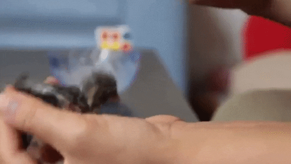
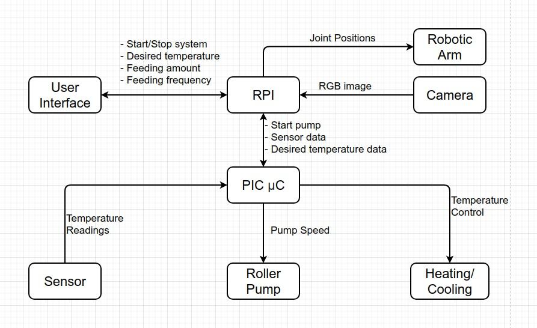

# Automatic Bird Feeding System

_An automated feeding system for orphaned baby birds._

  

## Description and System Overview

The goal of this project is to automate the process of feeding baby birds. The system overview is shown bellow. It's composed of 4 main parts:

-   The stainless steel food container, that has to be kept cooled
-   The pump system, that pushes the food up to the bird when needed
-   The heating system, so that the food has adequate temperature when it is fed to the bird
-   The robotic arm system, that directs the feeding hose to be near the bird's mouth

We also made a web interface to interact with the system, that can be used on the cellphone or a laptop.

  

