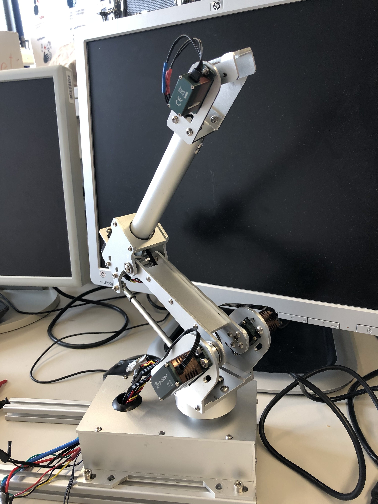

# Automatic Bird Feeding System

An automated feeding system for baby birds.

[Video](https://www.youtube.com/watch?v=6FqtNmXnx0E)

[First prototype test](https://www.youtube.com/watch?v=i5xlb1sEyUY)

   
  <i>Feeding orphaned baby birds is a manual task, which we aim to automate on this project</i>

  

## Description and System Overview

The goal of this project is to automate the process of feeding baby birds. The system overview is shown. It's composed of 4 main parts:

-   The stainless steel food container, that has to be kept cooled
-   The pump system, that pushes the food up to the bird when needed
-   The heating system, so that the food has adequate temperature when it is fed to the bird
-   The robotic arm system, that directs the feeding hose to be near the bird's mouth

We also made a web interface to interact with the system, that can be used on the cellphone or a laptop.

  

## Architecture

A Raspberry Pi runs the main controller, that provides a user interface via web server to the system, and communicates with other microcontrollers to perform the main functions.

A PIC microcontroller is used to communicate with temperature sensors, control the Roller Pump as well as the Heating and Cooling elements, using PWM signal.

Finally, an Arduino Due is used to control a robot Arm, via USB communication with the Raspberry Pi, receiving the desired angles for the Arm's servos.

  

## Modules

### Webserver

We make a user-friendly interface via web server to control the system and access the variables

  

### Electric Circuit

We created a PCB to solder the main electrical components, including the microcontroller, the PWM control signal pins for the Pump, Heater and Cooling elements, as well as MOSFET's for supplying current.

  

### Robot Arm

Is used to direct the feeding hose to the birds mouth. We wrote the Arduino Due's driver's as well as the Linux drivers in python to communicate with the arduino via USB (serial communication).

  

